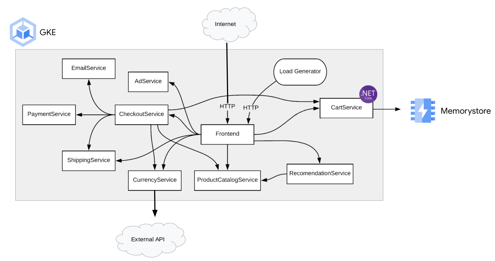
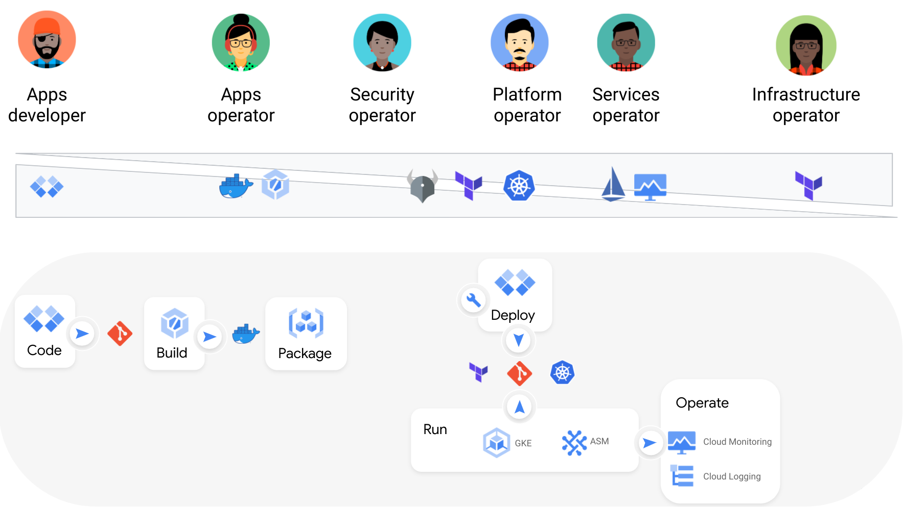

`Sail Sharp, .NET Core & Kubernetes` is an opiniated implementation to illustrate best practices to build and deploy .NET Core apps on Kubernetes.

It consists on 2 aspects:
- [.NET Core app](https://github.com/mathieu-benoit/cartservice) repo to host the code of the app and the Continuous Integration (CI) part
- [Kubernetes manifests](https://github.com/mathieu-benoit/my-kubernetes-deployments/tree/main/namespaces/onlineboutique) repo to host the manifest files ready to be deployed in Kubernetes via a GitOps CD way

## Architecture

## Workflow & personas

